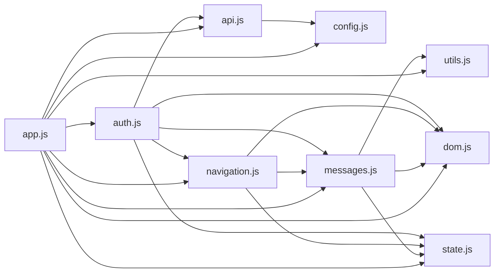
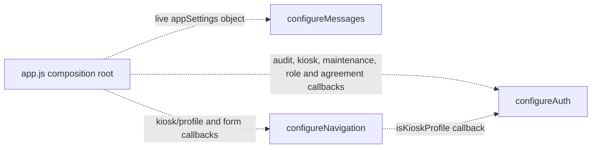

# VMS JavaScript Dependency Map

Milestone: `NextGen-013`  
Reviewed modules: `app.js`, `config.js`, `state.js`, `utils.js`, `dom.js`, `messages.js`, `api.js`, `navigation.js`, and `auth.js`

## Current Position

The native ES module graph is statically acyclic. The extracted modules form a usable foundation, but `app.js` remains both the composition root and the main implementation module. It currently contains approximately 7,350 lines, 336 named functions, 77 direct RPC calls, and 26 direct table access calls.

No code dependencies were removed during this review. Every static import is used, and replacing the remaining direct imports with additional callback configuration would increase temporal coupling without removing an actual cycle.

## Static Module Dependency Graph

An arrow means that the module at the arrow tail statically imports the module at the arrow head.

The corresponding topological layers are:

1. `config.js`, `state.js`, `utils.js`, and `dom.js`
2. `api.js` and `messages.js`
3. `navigation.js`
4. `auth.js`
5. `app.js`

## Runtime Configuration Edges

Some dependencies are supplied at startup rather than expressed as imports:

These edges avoid static cycles, but they require configuration to finish before the affected functions are called.

## Public Exports

| Module | Public exports |
|---|---|
| `app.js` | None. It is the browser entry point and composition root. |
| `config.js` | `SUPABASE_URL`, `SUPABASE_ANON_KEY`, `KIOSK_TOKEN_STORAGE_KEY`, `getDefaultAppSettings` |
| `state.js` | `AppState` |
| `utils.js` | `todayDate`, `safe`, `formatPersonName`, `normalisePlate`, `csvEscape`, `exportDateStamp`, `boolString`, `printEscape`, `formatPrintDate`, `formatPrintTime` |
| `dom.js` | `$` |
| `messages.js` | `configureMessages`, `showMessage`, `clearMessage`, `showToast`, `showKioskConfirmation`, `closeKioskConfirmation` |
| `api.js` | `supabaseClient` |
| `navigation.js` | `configureNavigation`, `showScreen` |
| `auth.js` | `configureAuth`, `openLoginModal`, `closeLoginModal`, `roleLabel`, `isKioskProfile`, `updateHomeAccess`, `updateTopbarStaffStatus`, `getCurrentSessionAndProfile`, `loginStaff`, `openChangePasswordModal`, `closeChangePasswordModal`, `changeOwnPassword`, `logoutStaff`, `openStaffAreaFromProfile` |

## Private Responsibilities

### `app.js`

- Creates and retains the mutable runtime `appSettings` object.
- Configures messaging, navigation, and authentication modules.
- Owns application startup, event registration, and the top-level error boundary.
- Retains kiosk token validation, heartbeat, idle activity, and protected kiosk logout.
- Retains settings loading, settings administration, branding, field rules, and governance.
- Retains role-panel and Super User section switching.
- Retains audit context, audit administration, and most audit writes.
- Retains planned visits, visit history, kiosk sign-in/sign-out, analytics, dashboards, agreements, GDPR, retention, notifications, deployment health, exports, and printing.
- Retains feature caches and workflow state not yet moved into `AppState`.

### `config.js`

- Owns immutable default application settings.
- Creates fresh settings objects with an independently cloned `fieldRules` object.
- Owns the Supabase endpoint, public anonymous key, and kiosk token storage key.

### `state.js`

- Owns the shared mutable `AppState` singleton.
- Stores selected planned/history/audit caches, the current profile, raw system settings, the opportunistic auto-sign-out flag, and the kiosk idle timer.
- Does not enforce ownership or mutation rules for individual properties.

### `utils.js`

- Owns pure date, text normalization, CSV quoting, boolean formatting, and print formatting helpers.
- Has no imports, shared state, DOM access, or backend access.

### `dom.js`

- Owns the single DOM lookup helper.
- Has no state and no imports.

### `messages.js`

- Owns general page messages, staff toasts, and kiosk confirmation presentation.
- Privately owns toast de-duplication history and the kiosk confirmation timer.
- Holds a live reference to `appSettings` after `configureMessages`.
- Uses `AppState.currentProfile` to decide whether a page message should also produce a staff toast.

### `api.js`

- Creates and exports the primary Supabase client.
- Relies on the classic Supabase CDN script having populated `window.supabase` before module evaluation.
- Does not yet own any query functions.

### `navigation.js`

- Owns top-level screen visibility, active screen classes, page-message clearing, kiosk idle timer cancellation, and walk-in modal cleanup during screen changes.
- Holds callbacks supplied through `configureNavigation` for kiosk-profile checks, walk-in cleanup, kiosk idle binding/reset, and Super User kiosk-test state.
- Does not yet own staff role-panel or Super User subsection navigation.

### `auth.js`

- Owns staff session/profile loading, login, logout, password changes, login/password modals, top-bar identity state, and home access state.
- Owns private staff-profile checks, identity-chip rendering, and staff search-cache cleanup during logout.
- Uses injected callbacks for audit writes, kiosk verification/heartbeat, daily maintenance, walk-in cleanup, role selection, agreement loading, and Super User section selection.
- Uses `AppState.currentProfile` as the shared profile source.

## Circular Dependency Assessment

### Current static cycles

None.

### Latent or conceptual cycle risks

1. `auth.js` statically imports `navigation.js`, while `navigation.js` receives `isKioskProfile` from `auth.js` through `app.js`. Converting that callback into a direct import would create an `auth`/`navigation` cycle.
2. `auth.js` receives `setRole`, `loadAgreementVersions`, and `showSuperSection` from `app.js`. Moving any of those functions into a module that imports `auth.js` would create a cycle unless the orchestration boundary is redesigned first.
3. `navigation.js`, `auth.js`, and `messages.js` have configuration-before-use requirements. Import order alone does not make them ready; `app.js` must call their configuration functions.
4. `AppState` is acyclic but globally mutable. As more modules import it, hidden data coupling can replace explicit import cycles.
5. `api.js` has an implicit runtime dependency on `window.supabase` and therefore on script order in `index.html`.

## Dependency Issues Found

- `app.js` remains the dominant dependency hub and implementation owner.
- The configuration objects passed to `configureNavigation` and `configureAuth` are untyped service-locator-style bundles. Missing properties fail only when the affected path executes.
- `auth.js` crosses authentication, home/top-bar presentation, staff-cache cleanup, kiosk lifecycle, maintenance, audit, navigation, and agreement-loading boundaries.
- `navigation.js` contains kiosk and walk-in cleanup policy as well as screen switching.
- `messages.js` depends on mutable settings through initialization order rather than an explicit function parameter or shared settings store.
- `AppState` mixes session state, timers, raw settings, and feature caches without named mutation APIs.
- `safe` is a display fallback helper rather than an HTML escaping helper, despite being used while building toast HTML. This review preserves that existing behavior but the naming and usage deserve a separate security-focused decision.

## Recommended Extraction Order

1. **Audit foundation (`audit.js`)**  
   Extract `writeAuditEvent` and its browser-context construction with explicit inputs for application version and kiosk-token presence. This removes the audit callback from `configureAuth` and creates a reusable low-level service without moving audit administration UI.

2. **Kiosk session infrastructure (`kiosk-session.js`)**  
   Extract kiosk token storage, device verification, heartbeat lifecycle, idle-timer lifecycle, and protected kiosk session helpers. Keep visitor sign-in/sign-out workflows separate. This should remove several callbacks currently passed to authentication and navigation.

3. **Settings read model (`settings.js`)**  
   Separate loading, merging, and reading settings from settings-form rendering and administration. Preserve the live `appSettings` object until all consumers have explicit access patterns.

4. **Export and printing helpers (`exports.js`)**  
   Move row normalization, CSV/download operations, workbook sizing, Excel export, and print-document generation before moving feature workflows that consume them.

5. **Planned-visit service and feature modules**  
   Separate backend access from planned-visit rendering, editing, and creation. Preserve DOM IDs, query shapes, and date semantics.

6. **Visit-history and security operations modules**  
   Extract history search/rendering, dashboards, analytics, maintenance, and auto-sign-out only after shared planned/history contracts are explicit.

7. **Agreement service and feature modules**  
   Split backend calls, agreement workflow state, signatures, evidence, compliance, and administration in small stages.

8. **GDPR and retention modules**  
   Keep case management, subject search, SAR/evidence generation, anonymisation, privacy, and retention operations behind explicit service boundaries.

9. **Notification modules**  
   Separate templates, queue operations, in-app notifications, trigger checks, and email delivery.

10. **Complete navigation extraction**  
    Move `setRole` and Super User subsection navigation only after their dashboard and feature-loading dependencies have module APIs.

11. **Reduce `app.js` to composition and startup**  
    Leave dependency configuration, event wiring, startup order, and the top-level error boundary in the entry point.

## Recommended Next Extraction

The next bounded milestone should extract the audit foundation only. It has broad reuse, limited UI impact, and can remove one important callback dependency from authentication without pulling a feature workflow out of `app.js`.
