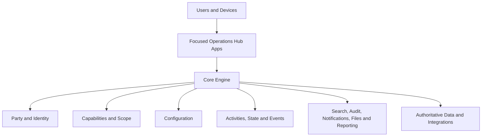

# Operations Hub Blueprint

Milestone: `OH-001`  
Status: Architectural reference  
Scope: Product vision, platform boundaries, operating principles and long-term direction

## 1. Vision

### Operations Hub mission

Operations Hub is a company-agnostic operational platform that gives people one reliable place to understand what is happening, what needs attention and what should happen next.

Its mission is to connect people, organisations, work, assets and operational events into a shared source of truth. The platform should reduce fragmented records, repeated data entry, hidden work and decisions made from incomplete information.

Operations Hub is not intended to be a collection of unrelated administration screens. It is a common operational engine with focused apps that present the right information and actions for a particular job.

### Product philosophy

The product should:

- Know what it can from existing records before asking a user.
- Present current operational state, not merely stored data.
- Put exceptions, risks and next actions ahead of passive reporting.
- Make routine work fast and predictable.
- Preserve the evidence behind every material decision and state change.
- Adapt to different companies through configuration rather than forks.
- Let each app remain focused while sharing the same people, organisations, security, configuration and history.
- Support users returning to interrupted work without reconstructing context.

Success means a user can open the Hub and quickly answer:

1. What is happening now?
2. What requires my attention?
3. What has changed?
4. What am I allowed to do?
5. What should I do next?

## 2. Core Principles

### Single Source of Truth

Each real-world subject should have one authoritative identity. Apps may present different views of a person, organisation, assignment or event, but they must not create competing master records.

Data ownership must be explicit. Derived views, indexes and reports are permitted; independent copies that can drift are not.

### Configuration over Code

Company policy, terminology, workflow options, required fields, thresholds, branding and notifications should be configuration wherever practical. Code should implement stable platform capabilities and validated rules, not one customer's organisational habits.

### Company Agnostic

The Core Engine must not assume a specific company name, department structure, site model, role vocabulary or operating process. Company-specific choices belong in configuration and reference data.

### Know Before You Ask

The platform should reuse known facts, infer safe defaults and carry context between steps. Users should not repeatedly enter information already held by the Hub.

Inference must be transparent. A user must be able to see and correct a proposed value where correction is permitted.

### Minimise Thinking

Interfaces should make the normal path obvious. Defaults, ordering, wording and action placement should reduce memory load and unnecessary decisions without concealing important consequences.

The platform should distinguish between information a user must decide and information the system can determine.

### Exception Management

Routine success should require little attention. Dashboards and work queues should emphasise overdue, blocked, invalid, missing, conflicting or high-risk items.

An exception must explain:

- What is wrong.
- Why it matters.
- Who can act.
- What action is available.
- When it became an exception.

### Capability Driven

Access is based on named capabilities and scope, not hard-coded role checks. Roles remain useful as presets that assign capabilities, but the capability is the enforceable unit.

### Consistent UI Language

The same visual and interaction patterns should mean the same thing in every app. Status, risk, primary actions, destructive actions, filters, tables, side panels, confirmations and notifications must use a common design language.

### Operational State

The Hub should expose meaningful state such as planned, expected, active, overdue, blocked, completed, cancelled or archived. State must be derived from authoritative facts and governed transitions rather than presentation-only labels.

Where possible, every state should have:

- A clear definition.
- Its supporting facts.
- Permitted transitions.
- Applicable capabilities.
- Expected next actions.

### Continue My Work

The platform should help users resume interrupted work. Relevant filters, selected records, drafts, recently viewed items and pending actions should be recoverable where privacy and security allow.

Resumption must never bypass revalidation of permissions or current operational state.

### History is Sacred

Material history is append-only in meaning. Corrections should preserve what was previously recorded, who changed it, when it changed and why.

Operational records must not be silently rewritten to make the past look cleaner. Retention or anonymisation may transform data under controlled policy, but the action itself must remain auditable.

Operations Hub platform actions must be auditable. Master-data creation, updates and lifecycle transitions should record the actor, affected entity, event type and safe change context without exposing secrets or sensitive authentication data. An audit-write failure must not reverse or block an otherwise successful platform action.

### Engine vs Configuration

The Engine defines what the platform can do. Configuration defines how a company chooses to use those capabilities.

This boundary must remain visible:

- Engine changes require engineering, testing and release control.
- Configuration changes require validation, capability checks, audit history and safe defaults.
- Configuration must not become an ungoverned scripting mechanism.

## 3. Core Entities

The entity model is shared across apps. Each entity has a stable identifier, lifecycle state, timestamps and attributable history.

### Party

Party is the common identity abstraction for a person or organisation that participates in operations.

A Party:

- Has one stable platform identity.
- May have names, contact methods, external references and relationships.
- Can participate in assignments, activities and events.
- Can be searched consistently across apps.
- Must support controlled matching, merging and correction without losing history.

Person and Organisation are specialised Party types. Apps should reference a Party identity rather than maintaining app-specific copies.

### Person

Person represents an individual known to the platform, including employees, visitors, contractors, drivers, agency workers and contacts.

Person stores identity facts and relationships, not a fixed operational role. The same person may be an employee for one period, a visitor at another site and a driver for a delivery.

Sensitive personal data must be minimised, capability-protected, retained according to policy and auditable when accessed or changed.

### Organisation

Organisation represents a company, supplier, agency, customer, contractor, department or other organisational party.

Organisations may:

- Have parent/child relationships.
- Employ, supply, host or sponsor people.
- Own or operate assets.
- Participate in assignments, deliveries and visits.
- Carry company-specific references and compliance status.

### Work Assignment

Work Assignment connects a Person to operational work within a defined context and time period.

An assignment may identify:

- The organisation or employer.
- Site, area, team or cost centre.
- Work type, position or function.
- Planned start and end.
- Actual start and end.
- Required qualifications, checks or agreements.
- Current operational state.

Employment is one possible assignment type, not the universal Person model.

### Activities

Activities represent planned, requested or actionable work. Examples include a visit, shift, task, delivery slot, vehicle inspection, induction or approval.

An Activity has:

- A purpose.
- Participants or responsible parties.
- Planned timing and location.
- Current state.
- Requirements and exceptions.
- Links to the events that prove progress or completion.

Activities describe what should happen. Operational Events record what did happen.

### Operational Events

Operational Events are timestamped facts such as arrival, departure, assignment, approval, cancellation, status transition, notification, failed check or administrative correction.

Events should be:

- Attributable to a user, device, integration or system process.
- Immutable in meaning.
- Linked to affected entities.
- Rich enough to reconstruct material history.
- Safe to consume in timelines, audit views, dashboards and downstream integrations.

Current operational state may be stored for performance, but it must remain explainable from authoritative records and events.

## 4. Platform Architecture

Operations Hub separates the reusable Core Engine from user-facing Apps.

### Core Engine

The Core Engine provides platform-wide capabilities:

- Party, Person and Organisation identity.
- Authentication, sessions, capabilities and scope.
- Company, site and application configuration.
- Work assignments and common activity/state models.
- Operational event and audit recording.
- Search and identity resolution.
- Notifications and delivery channels.
- Files, evidence and generated outputs.
- Reporting primitives and export services.
- Validation, workflow rules and exception evaluation.
- Integration contracts and background processing.

The Engine must contain no app-specific page layout and no company-specific policy constants.

### Apps

Apps are focused operational experiences built on the Core Engine. An app:

- Solves a coherent set of user jobs.
- Uses shared entities instead of duplicating them.
- Requests capabilities from the Engine.
- Applies validated configuration.
- Contributes activities and operational events.
- Uses the shared UI language.
- Exposes small, explicit integration boundaries to other apps.

Apps may evolve independently at the presentation and workflow level, but they must not redefine shared identity, security, audit or configuration semantics.

## 5. App Philosophy

### Visitors

Visitors manages planned and walk-in visits, arrival, departure, host/contact context, privacy acknowledgement, agreements, kiosk operation, visitor history and security oversight.

The existing Visitor Management Solution is the first operational foundation and a migration source for shared Hub patterns.

### People

People is the authoritative search and profile experience for individual and organisational Parties. It provides identity resolution, contact information, relationships, activity history and links into app-specific records.

People is not an employee-only directory.

### Employee Register

Employee Register manages the governed employment view of people: employment status, organisational placement, key dates, references and required employment records.

It uses Person and Organisation identities from the Engine and should not create a second person master.

### Labour (LMT)

Labour supports operational labour management: available labour, assignments, attendance context, supplied labour, exceptions and labour-related operational status.

LMT should consume Work Assignments and Events so labour information remains consistent with People, Employee Register and Planning.

### Planning

Planning manages future operational demand, schedules, assignments and conflicts. It should show whether planned work is viable based on people, capability, availability, assets and site configuration.

Planning creates intent; operational apps and events confirm what occurred.

### Vehicles

Vehicles manages vehicle identities, ownership/operation relationships, access context, status, checks, assignments and history.

Vehicle data should link to Organisations, People, Deliveries and Visits without duplicating those entities.

### Deliveries

Deliveries manages expected and actual deliveries, booking windows, suppliers, drivers, vehicles, locations, arrival/departure and exceptions.

It should reuse Party, Person, Organisation, Vehicle, Activity and Event models.

### Reports

Reports provides governed operational reporting across apps. It should offer reusable filters, saved views, exports and scheduled outputs while respecting the viewer's capabilities and data scope.

Reports is a consumer of authoritative data, not a second business-logic engine.

The Reporting Centre is the module-independent entry point for reports, exports and analytics. Report definitions and outputs should be reusable across apps, use authoritative shared entities, and link to existing module-owned tools until a governed shared reporting capability replaces them. A reporting shortcut must not duplicate or silently diverge from the underlying query, export or permission behaviour.

### Administration

Administration manages platform configuration, companies, sites, capabilities, role presets, users, devices, integrations, retention, branding and system health.

Administration must distinguish clearly between safe configuration and changes that require an Engine release or data migration.

## 6. Capability Model

Fixed roles are replaced as the security primitive by capabilities. Role names remain available as administrative presets.

### Capability structure

A capability should name a meaningful action, for example:

- `visitors.view`
- `visitors.sign_out`
- `visitors.history.edit`
- `people.view_sensitive`
- `employees.manage`
- `planning.assign`
- `deliveries.approve`
- `administration.configuration.manage`

Capabilities may be constrained by scope, such as company, site, team, own records or assigned work.

### Role presets

A role preset is a maintained bundle of capabilities, such as Reception, Security, Supervisor or Administrator. Presets:

- Accelerate user setup.
- Provide understandable operational starting points.
- May be company-configured.
- Do not replace capability checks.
- Must not grant access merely because a matching label appears in the UI.

Internal role codes use lowercase snake_case. The canonical profile and role-preset codes are `general_user`, `security`, `super_user` and `kiosk_user`. Display names such as “General User” and “SuperUser” are presentation labels and remain separate from internal codes. Where a role preset exists for a profile role, `role_presets.role_code` must exactly match `profiles.role`; capability loading must not translate between alternate role-code spellings.

### Enforcement

Capabilities must be enforced at trusted service and data boundaries. Hiding a button is a usability measure, not security enforcement.

Every protected action should answer:

1. Which capability is required?
2. What scope applies?
3. Which record or Party is being acted upon?
4. Is the decision auditable?

Capability changes, preset changes and user assignments must be historically attributable.

The Access Control administration workspace allows authorised SuperUsers to edit capability assignments for existing role presets. Access Control is transitioning the platform from role-based to capability-based authorisation, but some legacy role checks remain until their enforcement boundaries are migrated. `access_control.manage` is recovery-critical and must remain assigned to SuperUser alongside the protected administration capabilities. Role preset identity, capability definitions, capability groups and user overrides remain read-only until future governed editing adds appropriate validation, enforcement and audit history.

Capability Migration Phase 1 is complete for People, Reference Data, Access Control navigation and Administration navigation. These UI boundaries use the capability engine rather than role comparisons. `people.view` governs People visibility and `people.manage` governs People creation, editing and lifecycle actions.

Organisation capability migration is complete. `organisation.view` governs Organisation navigation, lists, search and detail access. `organisation.manage` governs Organisation creation, editing, activation and deactivation. Organisation UI checks no longer use `people.view` or `people.manage`. Existing legacy Visitors, Reporting, Dashboard, Audit and Kiosk role checks remain unchanged for later governed migration phases.

Organisation Details treat Contracts, assigned People and Sites as optional related summaries. A user with `organisation.view` can open the Organisation record even when existing Contracts or Work Assignment policies do not expose those related rows; unavailable summaries do not block or close the detail view.

Assignment capability migration is complete. `assignment.view` governs Assignment subsection visibility and read-only current/historical lists within an authorised People workspace. `assignment.manage` governs Assignment creation, editing, ending and reactivation. Assignment UI checks no longer use `people.manage`; People records remain independently governed by `people.view` and `people.manage`.

## 7. UI Philosophy

### Responsive-first

Every app is designed for its likely operating environments from the beginning: desktop, tablet, kiosk and constrained mobile views. Responsive behavior is part of the component contract, not a final styling pass.

### Common page layout

Apps share a predictable shell:

- Product and app identity.
- Current company/site context.
- Global search.
- Today's Focus and exceptions.
- Primary workspace.
- Contextual actions.
- User/session and help controls.

### Progressive disclosure

Show the information needed for the current decision first. Advanced filters, secondary metadata and uncommon actions should remain available without overwhelming the normal path.

Progressive disclosure must not hide risk, mandatory requirements or destructive consequences.

### Side panels

Use side panels for record context, review and lightweight edits that benefit from preserving the underlying list or dashboard. Use full pages for deep workflows and modals for short confirmations or tightly bounded decisions.

### Toast notifications

Toasts confirm brief, non-blocking outcomes. Validation belongs near the affected input; important errors remain visible; destructive or consequential actions require explicit confirmation.

Message tone and status types must remain consistent across apps.

### Search-first

Users should be able to start from a person, organisation, reference, vehicle or operational identifier without knowing which app owns the record.

Search results must disclose record type, relevant context and permitted next actions. Search must respect capability and scope.

### Today's Focus

Today's Focus is the operational landing view: work due now, exceptions, recently changed items and resumable tasks relevant to the user.

It is personalised by capability, scope and operational responsibility, not merely by a fixed role name.

### Dashboard widgets

Widgets are concise views of operational questions. They should:

- Lead to the underlying records.
- Show freshness and scope.
- Prioritise exceptions and actionable state.
- Use common status definitions.
- Be configurable within governed limits.

Widgets must not become isolated calculations that disagree with reports or app lists.

## 8. Configuration Philosophy

Company-specific behaviour should be configured, not coded.

Configuration may define:

- Company and site identity.
- Terminology and labels.
- Branding.
- Enabled apps and capabilities.
- Role presets.
- Required/optional fields.
- Workflow options and state-transition rules.
- Thresholds, due dates and exception policies.
- Notifications and delivery channels.
- Retention and privacy policy.
- Reference data and integration endpoints.
- Dashboard and report defaults.

### Configuration requirements

Configuration must be:

- Schema-validated.
- Versioned or historically traceable.
- Capability-protected.
- Audited with actor, time and reason where appropriate.
- Supplied with safe platform defaults.
- Testable before activation when it materially changes workflow.
- Able to support effective dates where policy changes over time.
- Exportable and comparable for support and governance.

Configuration precedence should be explicit, for example platform default, company, site, app and permitted user preference. A more specific value must not silently override a security or legal control that is not delegable.

The platform must avoid configuration that embeds arbitrary executable code. New reusable behavior belongs in the Engine; customer choice among supported behavior belongs in configuration.

## 9. Long-Term Roadmap

### Phase 1 — Foundation and preservation

- Complete modular separation of the current Visitor Management Solution.
- Preserve current behavior and backend contracts while establishing clear ownership.
- Define the shared design language, entity vocabulary and regression baseline.
- Introduce documented capability and configuration contracts.

### Phase 2 — Core Engine

- Establish Party, Person, Organisation, Work Assignment, Activity and Operational Event foundations.
- Implement capability-and-scope authorization with role presets.
- Establish company/site configuration, shared search, audit and exception models.
- Define migration and coexistence contracts for existing visitor data.

### Phase 3 — Visitors as the first Hub app

- Migrate Visitors onto Core Engine identity, capability, configuration and event services.
- Modernise the UI using the shared responsive component language.
- Prove that history, exports, permissions and kiosk behavior remain reliable.

### Phase 4 — People and workforce operations

- Introduce People and Employee Register.
- Add Labour (LMT) and Planning using shared Work Assignments and Events.
- Establish cross-app Today's Focus and resumable work.

### Phase 5 — Assets and logistics

- Introduce Vehicles and Deliveries.
- Connect people, organisations, assignments, bookings, assets and site events.
- Expand exception management and cross-app operational dashboards.

### Phase 6 — Reporting, automation and integrations

- Deliver governed cross-app reporting, saved views and scheduled outputs.
- Add rule-driven notifications and automation with explicit audit history.
- Publish controlled integration contracts, webhooks and background processing.

### Phase 7 — Enterprise readiness

- Support multi-company and multi-site operation.
- Add enterprise identity integration and delegated administration.
- Demonstrate resilience, observability, recovery, performance and data-governance controls.
- Establish controlled environment promotion, migration and support processes.

Each phase requires explicit acceptance criteria, security/privacy review, migration strategy, rollback planning and regression evidence.

## 10. Design Decision Log

The following decisions are accepted as the initial Operations Hub architecture baseline.

| ID | Decision | Consequence |
|---|---|---|
| `OH-D001` | Operations Hub is one platform with a shared Core Engine and focused Apps. | Apps must reuse platform identity, security, configuration, events and UI language rather than create parallel foundations. |
| `OH-D002` | Party is the shared identity root for Person and Organisation. | App-specific person/company master records are transitional and must converge through governed migration and identity resolution. |
| `OH-D003` | Work Assignment is separate from Person. | Employment, labour supply, site placement and operational function can change without redefining identity. |
| `OH-D004` | Activities represent intent; Operational Events represent facts. | Current state must remain explainable from authoritative records and event history. |
| `OH-D005` | History is preserved and corrections are attributable. | Material records cannot be silently overwritten; retention/anonymisation actions are themselves auditable. |
| `OH-D006` | Configuration is preferred over company-specific code. | Supported variation must use validated, versioned and audited configuration; arbitrary executable configuration is prohibited. |
| `OH-D007` | The platform is company agnostic. | Company names, structures, terminology and policy defaults cannot be hard-coded into the Core Engine. |
| `OH-D008` | Capabilities and scope are the security authority; roles are presets. | UI role labels cannot grant access, and trusted backend boundaries must enforce every protected capability. |
| `OH-D009` | Operational state and exception management drive the user experience. | Dashboards and work queues prioritise actionable exceptions and next steps over passive data display. |
| `OH-D010` | The UI is responsive-first and uses a consistent cross-app language. | Shared components and interaction semantics are platform contracts. |
| `OH-D011` | Search, Today's Focus and Continue My Work are platform-level experiences. | Apps must expose searchable identities, actionable state and resumable context through common interfaces. |
| `OH-D012` | Shared modules remain independent of feature apps. | Dependencies flow from Apps to the Core Engine; reverse feature imports and circular dependencies are architectural defects. |
| `OH-D013` | Existing Visitor Management behavior is migrated incrementally. | Refactoring and migration must preserve approved behavior, backend contracts, permissions, outputs and history until an explicit decision changes them. |
| `OH-D014` | Material architecture changes are discussed and recorded before implementation. | New entity boundaries, security models, integrations and migrations require documented decisions, risks and rollback considerations. |

This blueprint is the reference point for future Operations Hub design. When a later decision changes it, the change must be recorded explicitly rather than being introduced implicitly through implementation.
